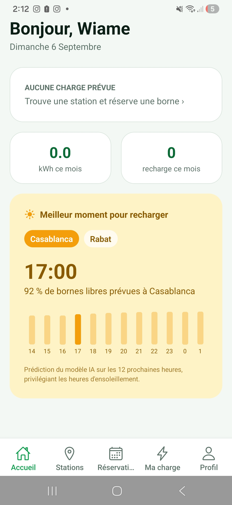
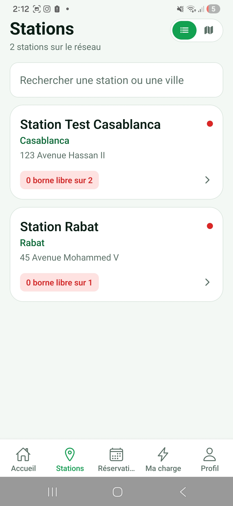
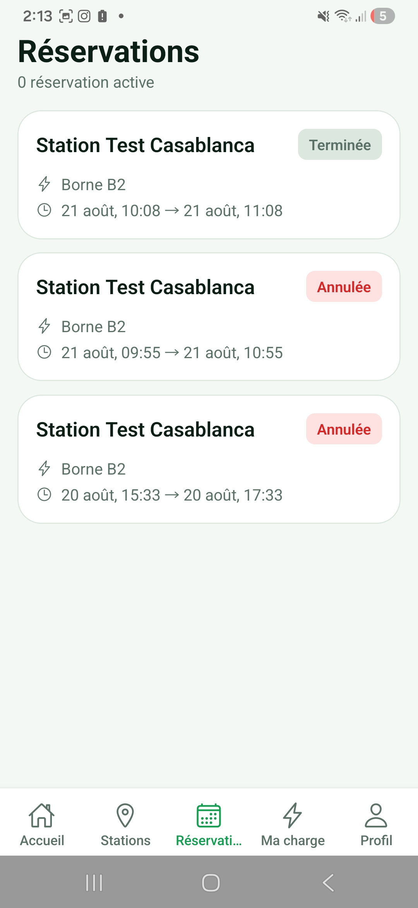
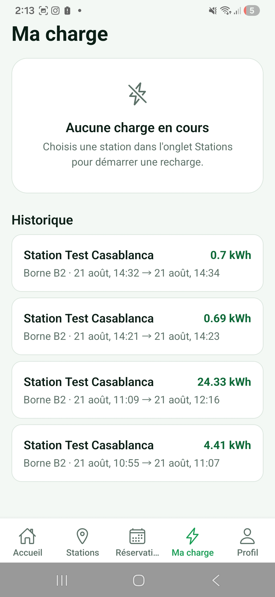
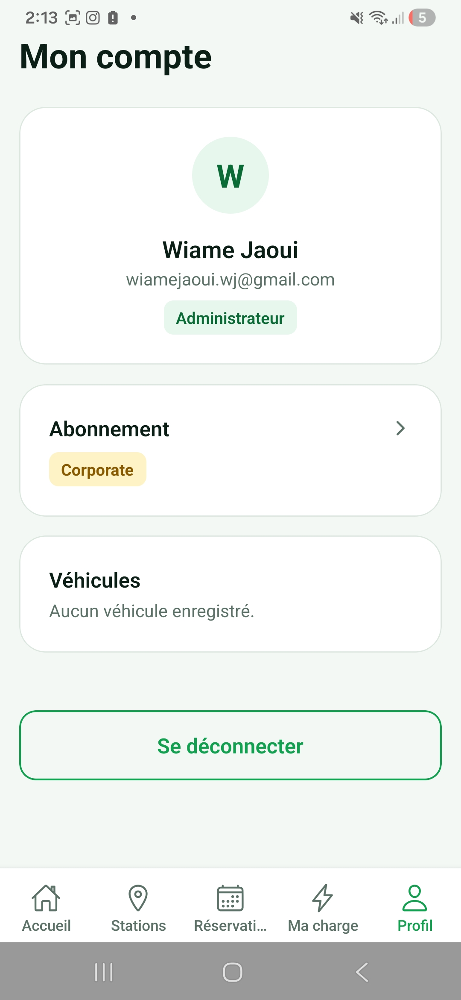
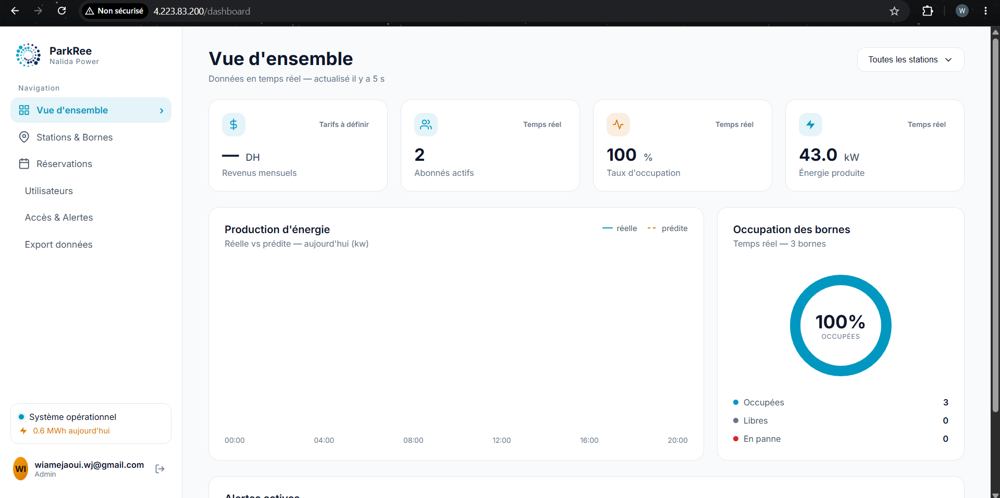
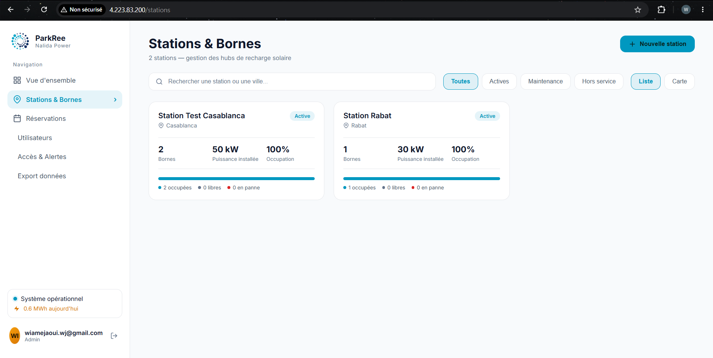
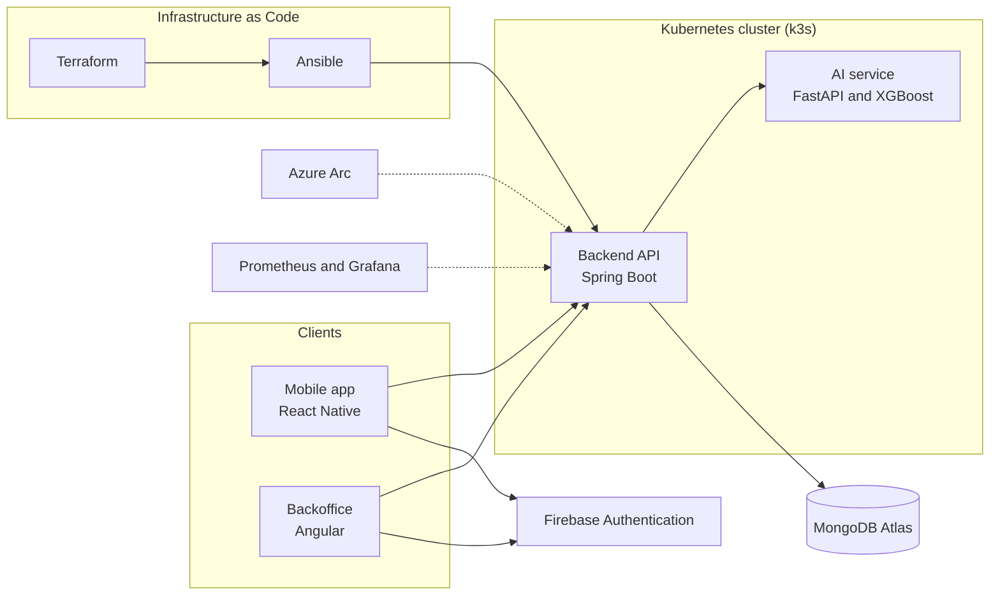

<div align="center">

# Solar Smart Parking Hub (ParkRee)

A connected platform for solar powered EV charging hubs, built end to end during a PFA internship at Nalida Power.


</div>

## Overview

ParkRee manages a network of solar powered EV charging hubs. Drivers find and reserve a charging spot from a mobile app, station administrators manage the network from a web backoffice, and an AI service forecasts station energy production to guide those recommendations. The stack is fully containerized, deployed on Kubernetes, and provisioned as code.

This repository is the deliverable of a PFA (Projet de Fin d'Année) internship at Nalida Power: a full stack and DevOps build covering four services and their production infrastructure.

## Contents

1. Features
2. Screenshots
3. Architecture
4. Technology stack
5. Project structure
6. Cloud infrastructure
7. Git workflow
8. Getting started
9. Continuous integration
10. Monitoring
11. Report and documentation
12. Author

## Features

| Feature | Description |
|---|---|
| Live station map | Real time view of charging station availability |
| Reservation flow | Search, book, charge, and manage subscription access |
| Authentication | Firebase authentication shared across mobile and backoffice |
| Energy forecasting | XGBoost model predicting station production, feeding slot recommendations |
| Admin dashboard | Stations, sessions, revenue and production indicators |
| Continuous integration | One pipeline per service, triggered only by changes in that service's folder |

## Screenshots

### Mobile application

| Home | Stations | Reservations |
|---|---|---|
|  |  |  |

| Charging session | Profile |
|---|---|
|  |  |

### Backoffice

| Dashboard |
|---|
|  |

| Stations management |
|---|
|  |

All screenshots were taken against the production deployment on Microsoft Azure described in the section below.

## Architecture



`backend`, `ai-service`, `backoffice` and `mobile` each live in their own folder with their own Dockerfile and CI pipeline. The backend is the single entry point for both clients and coordinates calls to the AI service and to MongoDB.

## Technology stack

| Layer | Technology |
|---|---|
| Backend API | Spring Boot (Java) |
| AI and prediction service | FastAPI (Python) with XGBoost |
| Mobile app | React Native |
| Backoffice | Angular |
| Database | MongoDB Atlas |
| Authentication | Firebase Authentication |
| Containerization | Docker |
| Orchestration | Kubernetes (k3s) |
| Infrastructure as code | Terraform and Ansible |
| Cloud (production demonstration) | Microsoft Azure and Azure Arc |
| Continuous integration | GitHub Actions |
| Monitoring | Prometheus and Grafana |

## Project structure

This is a monorepo: one repository, one folder per service. Each service has its own continuous integration pipeline, triggered only when its folder changes.

```
backend/         Spring Boot API (users, stations, chargers, reservations, sessions)
ai-service/      FastAPI microservice serving the energy prediction model
mobile/          React Native app for drivers
backoffice/      Angular dashboard for admins
deployment/      Terraform (Azure), Ansible playbooks and Kubernetes manifests
docs/            Specifications, diagrams and planning
```

## Cloud infrastructure

The stack is deployed on a self managed k3s Kubernetes cluster, provisioned entirely as code.

| Component | Role |
|---|---|
| Terraform | Provisions the cloud infrastructure declaratively (virtual machines, network, public IP addresses, security rules) from the configuration in `deployment/terraform` |
| Ansible | Configures the machines once they exist: installs and sets up k3s on the servers Terraform created, with no agent required on the target |
| Azure Arc | Connects the self managed cluster to Azure so it can be supervised through GitOps from the Azure portal, alongside standard kubectl access |
| GitHub Actions | Runs one continuous integration and deployment pipeline per service, building, testing and deploying only what changed |
| Prometheus and Grafana | Collect and visualize cluster and application metrics |

The project was deployed in production on Microsoft Azure (Azure for Students subscription) to validate the complete chain: mobile application, backoffice and backend all running against real cloud infrastructure. That deployment has since been removed (`terraform destroy`) to stop billing now that the internship demonstration is complete. The environment is reproducible in minutes with `terraform apply` followed by the Ansible playbook, against any cloud provider supported by Terraform.

## Git workflow

| Branch | Purpose |
|---|---|
| `main` | Always deployable, protected, triggers continuous deployment |
| `dev` | Day to day integration branch |
| `feature/*` | One branch per task, merged into `dev` through a pull request |

## Getting started

Clone the repository:
```bash
git clone https://github.com/wia-mej/Solar-Smart-Parking-Hub.git
cd Solar-Smart-Parking-Hub
```

### AI service
```bash
cd ai-service
pip install -r requirements.txt
uvicorn app.main:app --reload
```
Runs on `http://localhost:8000`. Check `http://localhost:8000/health` to confirm it is up.

### Backend
```bash
cd backend
mvn spring-boot:run
```

### Backoffice
```bash
cd backoffice
npm install
npm start
```

### Mobile
```bash
cd mobile
npm install
npx react-native start
```

## Continuous integration

Each service, `backend`, `ai-service`, `backoffice` and `mobile`, has its own GitHub Actions workflow under `.github/workflows`, filtered by path so a change in one service never triggers a rebuild of the others.

## Monitoring

Prometheus collects metrics from the application and the cluster. Grafana visualizes them alongside the backoffice's own production and revenue indicators.

## Report and documentation

This project was built as the deliverable of a PFA internship at Nalida Power. The complete internship report, covering architecture decisions, implementation details and the production deployment, is available on request. Additional specifications and diagrams are stored in `docs/`.

## Author

Wiame Jaoui, second year engineering student at ESI Rabat (ISITD), PFA intern at Nalida Power.
