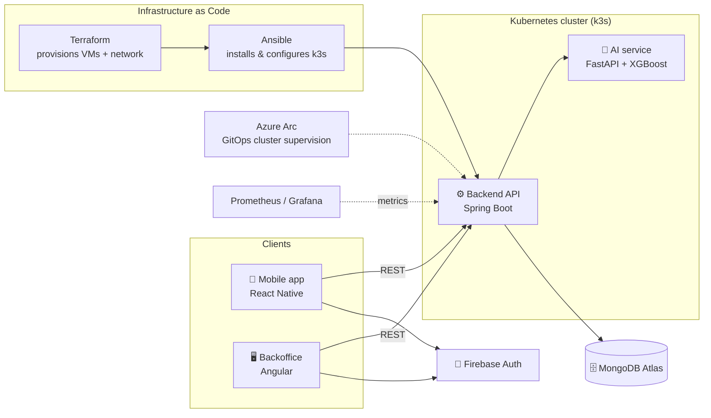

<div align="center">

# ☀️ ParkRee — Solar Smart Parking Hub

**A connected platform for solar-powered EV charging hubs**, built end-to-end during a PFA internship at **Nalida Power**.


</div>

---

## 📖 Overview

**ParkRee** manages a network of solar-powered EV charging hubs: drivers find and reserve a charging spot from a mobile app, station admins run the network from a web backoffice, and an AI service forecasts station energy production and availability to guide those recommendations. The whole stack is containerized, deployed on Kubernetes, and provisioned as code.

This repository is the deliverable of a PFA (Projet de Fin d'Année) internship at Nalida Power, a full-stack + DevOps build covering four services and their production infrastructure.

## 📑 Table of contents

- [Features](#-features)
- [Architecture](#-architecture)
- [Tech stack](#-tech-stack)
- [Project structure](#-project-structure)
- [Cloud infrastructure](#%EF%B8%8F-cloud-infrastructure)
- [Git workflow](#-git-workflow)
- [Getting started](#-getting-started)
- [CI/CD](#-cicd)
- [Monitoring](#-monitoring)
- [Report & documentation](#-report--documentation)
- [Author](#-author)

## ✨ Features

- 🗺️ Real-time map of charging stations with live availability
- 🔋 Reservation flow; search, book, charge, subscription-based access
- 🔐 Firebase-based authentication across mobile and backoffice
- 🤖 Energy-production forecasting (XGBoost) feeding slot recommendations
- 📊 Admin dashboard: stations, sessions, revenue and production KPIs
- 📦 One CI pipeline per service, each triggered only by its own folder's changes

## 🏗️ Architecture



Backend, AI service, backoffice and mobile each live in their own folder with their own Dockerfile and CI pipeline. The backend is the single entry point for both clients and orchestrates calls to the AI service and to MongoDB.

## 🧰 Tech stack

| Layer | Technology |
|---|---|
| Backend API | Spring Boot (Java) |
| AI / prediction service | FastAPI (Python) + XGBoost |
| Mobile app | React Native |
| Backoffice | Angular |
| Database | MongoDB Atlas |
| Auth | Firebase Authentication |
| Containerization | Docker |
| Orchestration | Kubernetes (k3s) |
| Infrastructure as Code | Terraform + Ansible |
| Cloud (production demo) | Microsoft Azure + Azure Arc |
| CI/CD | GitHub Actions |
| Monitoring | Prometheus + Grafana |

## 📂 Project structure

This is a monorepo — one repo, one folder per service. Each service has its own CI pipeline that only runs when its folder changes.

```
backend/         Spring Boot API (users, stations, chargers, reservations, sessions)
ai-service/      FastAPI microservice serving the energy prediction model
mobile/          React Native app for drivers
backoffice/      Angular dashboard for admins
deployment/      Terraform (Azure) + Ansible playbooks + Kubernetes manifests
docs/            Specs, diagrams, planning
```

## ☁️ Cloud infrastructure

The full stack is containerized and deployed on a self-managed **k3s** Kubernetes cluster:

- **Terraform** provisions the cloud infrastructure declaratively — VMs, virtual network, public IPs, NSG rules — from a single set of `.tf` files (`deployment/terraform`), reproducible and destroyable on demand.
- **Ansible** takes over once the machines exist: it installs and configures k3s on the Terraform-provisioned VMs with no agent required on the target.
- **Azure Arc** connects the self-managed cluster to Azure for GitOps-based supervision from the Azure portal, alongside the standard `kubectl` access.
- **GitHub Actions** runs one CI/CD pipeline per service, building, testing and deploying only what changed.
- **Prometheus & Grafana** collect and visualize cluster and application metrics.

The project was deployed end-to-end in production on **Microsoft Azure** (Azure for Students subscription) to validate the full chain — mobile app, backoffice and backend all running against real cloud infrastructure. That deployment has since been **torn down** (`terraform destroy`) to stop billing now that the internship demonstration is complete; the entire environment is reproducible in minutes with `terraform apply` followed by the Ansible playbook, against any cloud provider Terraform supports.

## 🔀 Git workflow

- `main` — always deployable, protected, triggers CD
- `dev` — day-to-day integration branch
- `feature/*` — one branch per task, merged into `dev` via PR

## 🚀 Getting started

Clone the repo:
```bash
git clone https://github.com/wia-mej/Solar-Smart-Parking-Hub.git
cd Solar-Smart-Parking-Hub
```

### AI service
```bash
cd ai-service
pip install -r requirements.txt
uvicorn app.main:app --reload
```
Runs on `http://localhost:8000`. Check `http://localhost:8000/health` to confirm it's up.

### Backend
```bash
cd backend
mvn spring-boot:run
```

### Backoffice
```bash
cd backoffice
npm install
npm start
```

### Mobile
```bash
cd mobile
npm install
npx react-native start
```

## 🧪 CI/CD

Each service (`backend`, `ai-service`, `backoffice`, `mobile`) has its own GitHub Actions workflow under `.github/workflows/`, path-filtered so a change in one service never triggers a rebuild of the others.

## 📊 Monitoring

Prometheus scrapes application and cluster metrics; Grafana dashboards visualize them alongside the backoffice's own production and revenue KPIs.

## 📄 Report & documentation

This project was built as the deliverable of a PFA internship at **Nalida Power**. The full internship report — architecture decisions, implementation details, and the production deployment walkthrough — is available on request. Additional specs and diagrams live under `docs/`.

## 👤 Author

**Wiame Jaoui** — 2nd-year engineering student, ESI Rabat (ISITD)
PFA intern @ Nalida Power
